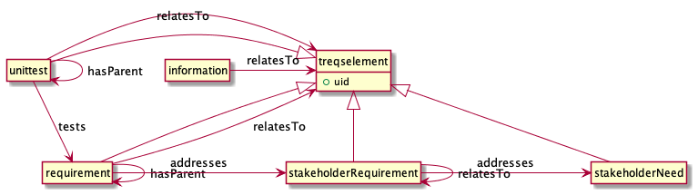

# Traceability strategy

In this document, we present the traceability strategy of treqs. 
Each project may adjust the traceability strategy for their context. 
For re-using our default traceability strategy, it is enough to copy the ```ttim.yml``` file to the new project.

The following diagram shows what is currently defined in treqs ttim.yml

Stakeholder needs describe a challenge that key stakeholders of treqs have. 
We do not anticipate the need to trace from stakeholder needs to any elements.


Stakeholder requirements are requirements from a stakeholder's point of view and capture our understanding on why somebody would like to use a tool such as treqs.
Stakeholder requirements are often motivated by stakeholder needs; in fact, they are our interpretation of what is needed to solve the stakeholder's problem.
Stakeholder requirements can also relate to other stakeholder requirements.

Requirements are in fact system requirements: A condition or capability that must be met by treqs to satisfy its intended use (which we aim to express through stakeholder requirements, see below).
Requirements may relate to any other treqs element and this can be expressed through the relatesTo trace link. 
They can also be a refinement of another requirements, which can be expressed through the hasParent linktype.
Finally, they should directly or indirectly (e.g. through a parent) be motivated by a stakeholder-requirement.

Information provides additional background or context, but is not a requirement by itself. 
Information can relate to any other treqs element.

Unittests are automatic tests that check whether a unit of the code works as intended.
Unittests can relate to any treqs element (linktype: relatesTo).
They can also be a refinement of another test (linktype: hasParent).
They may test an aspect of a requirements (linktype: tests).


```
@startuml ttim-model

hide circle
hide empty members

class treqselement {
+uid
}
class requirement

treqselement <|-- requirement
treqselement <|-- stakeholderNeed
treqselement <|-- stakeholderRequirement
treqselement <|-- unittest


requirement --> treqselement : relatesTo
requirement -> requirement : hasParent
requirement -> stakeholderRequirement : addresses

stakeholderRequirement -> stakeholderNeed : addresses
stakeholderRequirement -> stakeholderRequirement : relatesTo

unittest -> requirement : tests
unittest -> unittest : hasParent
unittest -> treqselement : relatesTo

information -> treqselement : relatesTo
@enduml
```

**Figure 1** Traceability model
