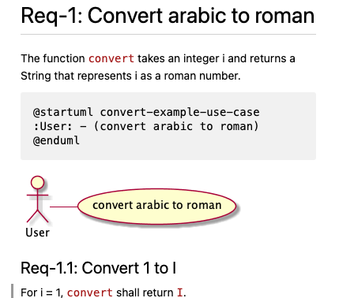

# TReqs demonstrator

## Getting started: TReqs demonstrator

- Assume that Alice and Bob want to create a function that translate latin numbers to roman numbers
- The start with a high-level requirement 
  - (which they store in a markdown file for now, since those are nicely layed out and well integrated in their git based development environment (gitlab or github))

```
# Req-1: Convert arabic to roman

The function takes an integer i and returns a String that represents i as a roman number.
```

## Basic workflow

- Alice wants to get started. Working in an agile way, she aims to use TestFirst

```
assertEquals("I", convert(1));
...
convert(int i) {return "I";}
...
# Req-1: Convert arabic to roman

The function `convert` takes an integer i and returns a String that represents i as a roman number.

## Req-1.1: Convert 1 to I

For i = 1, `convert` shall return `I`.
```

- Alice pushes these changes to her development branch and creates a merge request
- Bob reviews the change, sees that test, function, and requirement are updated and consistent
- The change is merged into the main branch
- Alice and bob continue with the number 2 to 10 in parallel

## Create requirements

- Now, to support this scenario, we want to add some support. 
  - Example, adding a link between the unit test and the Requirement 1
- If we want to offer tool support, we need to 
  - define a unique ID (otherwise, Alice and Bob creating each a Requirement 1.1 at the same time will cause chaos)
  - make it easy for the tool to define where a requirement or test starts and ends
- With treqs create, we can conveniently create syntactically correct treqs elements, that are still rendered as markdown elements

```
<treqs-element id="b1cd3dba866a11ebbdfcc4b301c00591" type="requirement">
## Req-1.1: Convert 1 to I

For i = 1, `convert` shall return `I`.

<treqs-link type="parent" target="72f032c0866d11ebac03c4b301c00591" />
</treqs-element>
```


## List requirements

- Now we have requirements in markdown files in a very useful form
  - They are easy to read for humans, either in the markdown file or in the rendered preview
  - They are easy to read for computers
- We can list requirements based on several criteria, which helps to keep an overview in large projects

```
knauss$ treqs list
| UID | Type | Label | File | Line |
| :--- | :--- | :--- | :--- | :--- |
| 72f032c0866d11ebac03c4b301c00591 | requirement | # Req-1: Convert arabic to roman | requirements/system-requirements.md | 2 |
| b1cd3dba866a11ebbdfcc4b301c00591 | requirement | ## Req-1.1: Convert 1 to I | requirements/system-requirements.md | 9 |
| 54ed41e2867111eb91e5c4b301c00591 | unit-test |    * ## arabic2roman test | src/se/treqs/example/numconv/NumConverterTest.java | 2 |
```

The output of treqs list can be rendered as a markdown table:

| UID | Type | Label | File | Line |
| :--- | :--- | :--- | :--- | :--- |
| 72f032c0866d11ebac03c4b301c00591 | requirement | # Req-1: Convert arabic to roman | requirements/system-requirements.md | 2 |
| b1cd3dba866a11ebbdfcc4b301c00591 | requirement | ## Req-1.1: Convert 1 to I | requirements/system-requirements.md | 9 |
| 54ed41e2867111eb91e5c4b301c00591 | unit-test |    * ## arabic2roman test | src/se/treqs/example/numconv/NumConverterTest.java | 2 |

## Trace requirements

- Through the UID, we can also create and explore tracelinks from tests to requirements
- In javadoc or other comments just in front of automated tests, we can add tracelinks such as

```
  /**
   * <treqs-element id="54ed41e2867111eb91e5c4b301c00591" type="unit-test">
   * ## arabic2roman test
   * 
   * This test checks requirement Req-1
   * <treqs-link type="required-by" target="72f032c0866d11ebac03c4b301c00591" />
   * </treqs-element>
   */
  @Test
  public void arabic2roman() {
     assertEquals("I", conv.convert(1));
     assertEquals("II", conv.convert(2));
     assertEquals("III", conv.convert(3));
  }
```

## Check requirements

- Several checks are possible. Most important: are critical tracelinks set

```
knauss$ treqs check
| Error location | Error | File | Line |
| :--- | :--- | :--- | :--- |
| Element b1cd3dba866a11ebbdfcc4b301c00591 | Unrecognised link type parent within element of type requirement. | requirements/system-requirements.md | 9 |
| Element 54ed41e2867111eb91e5c4b301c00591 | Element has an unrecognized type: unit-test | src/se/treqs/example/numconv/NumConverterTest.java | 2 |
treqs check exited with failed checks.
```

| Error location | Error | File | Line |
| :--- | :--- | :--- | :--- |
| Element b1cd3dba866a11ebbdfcc4b301c00591 | Unrecognised link type parent within element of type requirement. | requirements/system-requirements.md | 9 |
| Element 54ed41e2867111eb91e5c4b301c00591 | Element has an unrecognized type: unit-test | src/se/treqs/example/numconv/NumConverterTest.java | 2 |
treqs check exited with failed checks.


## Requirements as part of a commit

::: columns

:::: {.column width=60%}

- By working in an agile, test-driven way, we now have commits to bundle changes of software, tests, and requirements.

```
knauss$ git status
On branch dev
Changes not staged for commit:
  (use "git add <file>..." to update what will be committed)
  (use "git restore <file>..." to discard changes in working directory)
	modified:   requirements/system-requirements.md
	modified:   src/se/treqs/example/numconv/NumConverter.java
	modified:   src/se/treqs/example/numconv/NumConverterTest.java
```

::::

:::: {.column width=40%}


:::: 

:::

## Review requirements


## Modeling support

::: columns

:::: {.column width=30%}

- Write UML models as text
- Use github to version control and merge
- Use plantuml to convert to png
- Use treqs to create png references
- TReqs can be extended to allow clickable links in models and tracing of model elements

::::

:::: {.column width=70%}

{\vspace{-2cm}}

::::

:::
