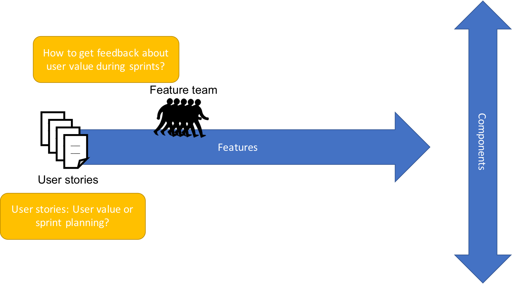
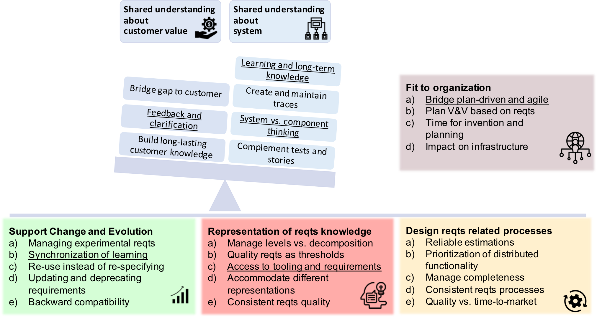

# Introduction 

## TReqs Pitch

- *Objective:* 
  - TReqs offers lightweight tooling to manage requirements in agile system development.
- *Philosophy:* 
  - TReqs empowers agile teams to manage requirements together with changes of code and test. 
  - This ensures transparency, consistency, scalability, and speed.
- *Offer:* The core of TReqs is available as open source. Based on this, we offer: 
  - **Integrating** TReqs into a specific company’s requirements strategy.
  - **Developing** a company's requirements strategy if needed. 
  - **Adjusting** TReqs to match specific needs  
  - **Training** for agile teams, product owners, system managers.  

## About us

- We have worked with many large systems engineering companies [@Knauss2019] 
  - Software center with Axis, Ericsson, Grundfos, Saab, Siemens, TetraPak, Volvo Cars, Volvo Trucks [@Kasauli2020b] 
  - Vinnova FFI (NGEA) with many automotive companies in the region [@Pelliccione2017]
- We find them struggle with similar challenges [@Liebel2016], [@Kasauli2020b]
  - Continuous Integration and Deployment [@KPH+2016]
  - RE for Scaled Agile System Development [@Kasauli2020b]
- There is no single solution for all challenges
  - But our treqs tool and concept is pretty promising for many challenges [@Knauss2018a]

## How requirements engineering has evolved

{width=80%}

## Why agile teams hate requirements [@Knauss2019]

{width=80%}

## Why agile teams hate requirements [@Knauss2019]

{width=80%}

<!--## Why user stories are not working well

{width=80%}

## Lack of requirements affects long-term knowledge about customer [@Knauss2019]

{width=80%}

## Lack of requirements affects inter-team coordination [@Knauss2019]

{width=80%}

## System engineering starts to fail if requirements are not managed [@Knauss2019]
-->

## No requirements is not a good solution [@Knauss2019]

{width=80%}

## RE challenges frequently encountered in scaled-agile system development [@Kasauli2020b]

{width=70%}

## Context and Motivation

- Engineering complex systems increasingly done agile and continuous
- Agile (SW) teams will discover new or wish to update existing requirements
- Any system level role that owns requirements will become a bottleneck 
- Agile teams avoid working with outdated requirements (don't read/don't update)
- System development looses a critical coordination mechanism

## TReqs core idea

- Distinguish high-level customer/market/problem-focused requirements from system/solution-focused requirements
- Give agile (SW) teams ownership of system requirements in a scalable way
  - Bring the requirements into the tools that agile teams work with
  - Integrate reviews of requirements changes into the quality assurance workflows of agile teams
  - Derive reports for system level roles 
  - Support DevOps vision of infrastructure-as-code
- Result: scalability, speed, and real control through up-to-date requirements
    - Instead of: illusion of control by gatekeeping requirements that are not used

# TReqs demonstrator

[Read demonstrator](treqs-demonstrator.md)

# TReqs useage

[Read tutorial](treqs-usage.md)

# Competition

## Competition

- Agile illusion claims that user stories, automated tests, and coding standards are sufficient
  - Does not scale for complex systems / multiple teams
  - Does not allow to trace customer requirements to system properties (automated tests perform poorly in that role) 
  - Regulatory needs are almost impossible to cover without sacrificing agility
- Classic requirements tools (Word, Excel, ...)
  - Do not grow with the needs of a startup/company
  - Very limited traceability and versioning
- Traditional requirements tools (Doors, RequisitPro, ...)
  - Licensing costs
  - Do not integrate into SW development tools
  - Do not intend massive parallel evolution of requirements
  - Do not integrate well with git and continuous deployment
- Git based tools (e.g. [doorstop](https://github.com/doorstop-dev/doorstop))
  - Do not provide the same level of conceptual depth
  - Start from wrong granulatity for tracing

## Benefits

- Text based
  - Easy to start or transition to
  - No vendor lockin
- Integrates in git
  - Very powerful support for versioning and continuous integration/deployment
  - Supports standard technology stack of agile teams
- Infrastructure-as-code
  - extensible, customizable
- Open source

# Conclusion

## Summary

- TReqs is ligthweight (textbased, git-based)
  - Integrates in any git based workflow
  - No demands on toolchain
  - No vendor login
- TReqs empowers agile teams to manage system requirements
  - Requirements can be kept consistent to development
  - Requirements management scales and matches development speed
- TReqs allows maximum support for a flexible and agile requirements strategy

## Open issues and Roadmap

- Basic functionality is now ready: 
  - list treqs elements, 
  - check their consistency with respect to an information model, 
  - create elements and links, 
  - process files to generate uml models
- treqs works well with gitlab and merge requests, we have done so in several projects
- Next steps:
  - Support for graphical models and links between model elements and treqs elements
  - Support for per project traceability information models that allows for complex checks
  - Support for per project heuristic critiques on requirements form and style

## References 
