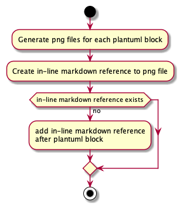

# TReqs usage

## Install 

- Clone the gitlab repository to local computer
- Set up a virtual python environment
- Open terminal, go to the folder that contains the gitlab treqs-ng

```
knauss$ source treqs_env/bin/activate
```

- With the virtual environment in place, install treqs

```
knauss$ cd treqs-ng
knauss$ pip install -e .
```

## Run

- With installation in place, we can now run `treqs` on the commandline.

```
knauss$ treqs --help
Usage: treqs [OPTIONS] COMMAND [ARGS]...

Options:
  --help  Show this message and exit.

Commands:
  check       Checks for consistency of treqs elements.
  create      Creates a treqs element and prints it on the command line.
  createlink  Creates a link to a treqs element.
  generateid  Generate a new id used for treqs element.
  list        List treqs elements in this folder
  process     Process a treqs-controlled file, i.e.
```

## treqs list

- On the command line, in a folder that contains treqs-controlled requirements 

```
knauss$ treqs list --help
Usage: treqs list [OPTIONS] [FILENAME]...

  List treqs elements in this folder

Options:
  --type TEXT                 Limit action to specified treqs element type
  --uid TEXT                  Limit action to treqs element with specified id
  --outlinks / --no-outlinks  Print outgoing tracelinks  [default: False]
  --inlinks / --no-inlinks    Print incoming tracelinks  [default: False]
  --recursive BOOLEAN         List treqs elements recursively in all
                              subfolders.

  --verbose / --no-verbose    Print verbose output instead of only the most
                              important messages.  [default: False]
  --plantuml / --no-plantuml  Generates a PlantUML diagram from the treqs
                              elements.  [default: no-plantuml]
  --help                      Show this message and exit.
```

## treqs list (example)

- Let's try it with the treqs requirements

```
knauss$ cd requirements
knauss$ treqs list 2-list-reqts.md 
| UID | Type | Label | File | Line |
| :--- | :--- | :--- | :--- | :--- |
| a0820e06-9614-11ea-bb37-0242ac130002 | requirement | ### 2.0 Parameters and default output of treqs list | 2-list-reqts.md | 1 |
| 63ef8bfa76ae11ebb811cf2f044815f7 | requirement | ### 2.1 Information listed by treqs list | 2-list-reqts.md | 36 |
| 437f09c6-9613-11ea-bb37-0242ac130002 | requirement | ### 2.2 Filter by type  | 2-list-reqts.md | 70 |
| abc40962a23511eba9dca7925d1c5fe9 | information | Note that the type should usually be defined in the TTIM. treqs list does however not check for this to be the case. Use treqs check instead to make sure that all types are consistent with the TIM. | 2-list-reqts.md | 83 |
| a0820b4a-9614-11ea-bb37-0242ac130002 | requirement | ### 2.3 Filter by ID | 2-list-reqts.md | 88 |
| bc89e02a76c811ebb811cf2f044815f7 | requirement | ### 2.4 List all elements in a file | 2-list-reqts.md | 102 |
| 638fa22e76c911ebb811cf2f044815f7 | requirement | ### 2.5 List treqs elements in a directory | 2-list-reqts.md | 111 |
| 1595ed20a27111eb8d3991dd3edc620a | requirement | ### 2.6 List outgoing tracelinks | 2-list-reqts.md | 122 |
| d9e68f9aa27b11eb8d3991dd3edc620a | requirement | ### 2.7 List incoming tracelinks | 2-list-reqts.md | 170 |
```

## treqs list (example)

- If we layout the table as markdown, it is much more readable.

{\tiny
| UID | Type | Label | File | Line |
| :--- | :--- | :--- | :--- | :--- |
| a0820e06-9614-11ea-bb37-0242ac130002 | requirement | ### 2.0 Parameters and default output of treqs list | 2-list-reqts.md | 1 |
| 63ef8bfa76ae11ebb811cf2f044815f7 | requirement | ### 2.1 Information listed by treqs list | 2-list-reqts.md | 36 |
| 437f09c6-9613-11ea-bb37-0242ac130002 | requirement | ### 2.2 Filter by type  | 2-list-reqts.md | 70 |
| abc40962a23511eba9dca7925d1c5fe9 | information | Note that the type should usually be defined in the TTIM. treqs list does however not check for this to be the case. Use treqs check instead to make sure that all types are consistent with the TIM. | 2-list-reqts.md | 83 |
| a0820b4a-9614-11ea-bb37-0242ac130002 | requirement | ### 2.3 Filter by ID | 2-list-reqts.md | 88 |
| bc89e02a76c811ebb811cf2f044815f7 | requirement | ### 2.4 List all elements in a file | 2-list-reqts.md | 102 |
| 638fa22e76c911ebb811cf2f044815f7 | requirement | ### 2.5 List treqs elements in a directory | 2-list-reqts.md | 111 |
| 1595ed20a27111eb8d3991dd3edc620a | requirement | ### 2.6 List outgoing tracelinks | 2-list-reqts.md | 122 |
| d9e68f9aa27b11eb8d3991dd3edc620a | requirement | ### 2.7 List incoming tracelinks | 2-list-reqts.md | 170 |
}

- This allows us to get the ID for a treqs element, e.g. for tracelinks

## treqs list (file pattern)
- treqs recognizes basic regular expression

```
knauss$  treqs list test_*
```
- Lists all all the files and directories that begin with ```test_```

```
knauss$ treqs list src/*.md
 ```
- Lists all the files in src directory with file extension ```md```

## treqs create

```
knauss$ treqs create
Which type should the element have? [requirement]: unittest
Which label should the element have? [my requirement]: ## arabic2roman test
<treqs-element id="54ed41e2867111eb91e5c4b301c00591" type="unittest">

## arabic2roman test
add additional information/details here
</treqs-element>
```


## treqs check

```
knauss$ treqs check --help
Usage: treqs check [OPTIONS] [FILENAME]...

  Checks for consistency of treqs elements.

Options:
  --recursive BOOLEAN       Check treqs elements recursively in all
                            subfolders.

  --ttim TEXT               Path to a type and traceability information model
                            (TTIM) in json format.

  --verbose / --no-verbose  Print verbose output instead of only the most
                            important messages.  [default: False]

  --help                    Show this message and exit.
```

## treqs process


```
knauss$ treqs process --help
Usage: treqs process [OPTIONS] FILENAME

  Process a treqs-controlled file, i.e. generate content in protected areas.

Options:
  --recursive BOOLEAN       Process all subfolder recursively.  [default:
                            True]

  --web / --no-web          Uses an external webservice to generate PlantUML
                            images (only with Treqs extensions).  [default:
                            False]

  --links / --no-links      Generates diagram code to URL links from a file
                            (only with Treqs extensions).  [default: False]

  --html                    Generate HTML with traceable diagrams (only with
                            Treqs extensions).

  --svg                     Generate SVG diagram images instead of PNGs (only
                            with Treqs extensions).

  --verbose / --no-verbose  Print verbose output instead of only the most
                            important messages.  [default: False]

  --help                    Show this message and exit.
```


```
@startuml process_plantuml
start
:Generate png files for each plantuml block;
:Create in-line markdown reference to png file;
if (in-line markdown reference exists) then (no)
  :add in-line markdown reference
after plantuml block;
endif
stop
@enduml
```


